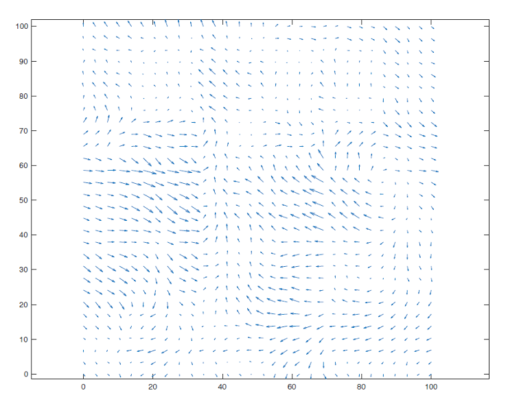

# dronePathPlanning
Drone Motion Planning Design &amp; Modelling Project

## About
The following project involves the details surrounding a plan for a time-optimal path utilized by an Unmanned Aerial Vehicle (UAV). The path of the UAV is assumed to travel point-to-point within a complex wind field. This is represented by a vector field at points within the 2D space denoted in figure 1. Each point represents a 2D vector representing the winds which are assumed to be known within the system design. Furthermore, this project includes an analysis of the system and its planning with each path.

<div align="center">

 *Figure 1: Wind Field Vector Space*
 
  <kbd>
    
  </kbd>
</div>

## Table of Contents

- [Overview](#overview)
- [Features](#features)
- [Project Objectives](#project-objectives)
- [Approach](#approach)
- [Getting Started](#getting-started)
- [Resources](#resources)
- [License](#license)

## Overview

The UAV's path planning is conducted within a simulated 2D environment characterized by varying wind conditions. By representing the wind field as a vector field, the project aims to determine the most time-efficient routes between specified points, considering the influence of wind on the UAV's motion.

## Features

- Time-optimal path computation in wind-affected environments
- Simulation of UAV trajectories within a 2D vector field
- Analysis of system dynamics and control strategies
- Visualization of planned paths and wind vectors

## Project Objectives

- Model a 2D wind field affecting UAV navigation
- Develop algorithms for time-optimal path planning
- Simulate UAV trajectories considering wind disturbances
- Analyze the effectiveness of different control strategies

## Approach

The project employs mathematical modeling and simulation techniques to achieve its objectives. Key steps include:

1. **Wind Field Modeling**: Representing the environment as a 2D vector field with known wind vectors at discrete points.
2. **Path Planning Algorithm**: Developing algorithms that compute the fastest route from a start to an end point, accounting for wind effects.
3. **Simulation**: Implementing simulations to test and visualize the UAV's trajectory within the modeled environment.
4. **Analysis**: Evaluating the performance of the path planning algorithm and the UAV's ability to follow the computed path under varying wind conditions.

## Getting Started

To explore or build upon this project:

1. **Clone the Repository**:
   ```bash
   git clone https://github.com/vish8426/dronePathPlanning.git
   cd dronePathPlanning
   ```

2. **Review Documentation**: Consult the provided PDF documents for detailed insights:
   - [`Motion Planning Report - 470416309.pdf`](Motion%20Planning%20Report%20-%20470416309.pdf): Comprehensive report on the project's methodology and findings.
   - [`Control of Multiple Robots.pdf`](Control%20of%20Multiple%20Robots.pdf): Discusses control strategies relevant to multi-robot systems.
   - [`Lighting Talk.pdf`](Lighting%20Talk.pdf): Summarizes key aspects of the project in a presentation format.

3. **Explore Source Code**: Navigate to the `src/` directory to examine the implementation details of the path planning algorithms and simulations.

## Resources

- **Reports and Presentations**:
  - [`Motion Planning Report - 470416309.pdf`](Motion%20Planning%20Report%20-%20470416309.pdf)
  - [`Control of Multiple Robots.pdf`](Control%20of%20Multiple%20Robots.pdf)
  - [`Lighting Talk.pdf`](Lighting%20Talk.pdf)

- **Source Code**:
  - [`src/`](src/): Contains the implementation of the path planning algorithms and simulation scripts.

## License

This project is licensed under the [MIT License](LICENSE), allowing for open collaboration and modification.
